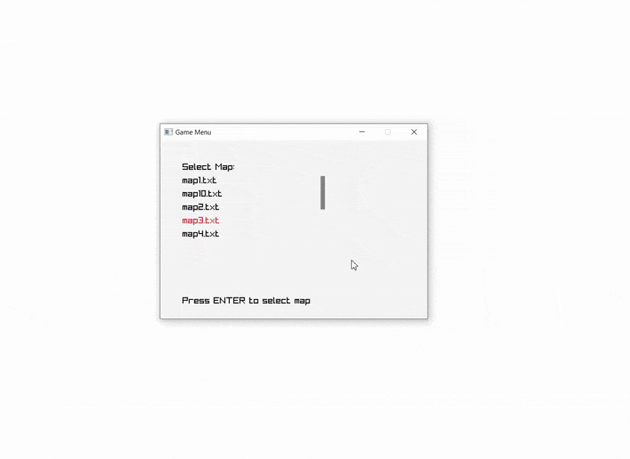

# Informed and Uninformed Searches

Implementations of classic AI search algorithms, both uninformed and informed.  
This project demonstrates how different strategies explore search spaces.  
The algorithms are compared across **10 different maps**, measuring:
- ⏱ Execution time  
- 📊 Number of visited states  

---

## 📂 Structure
- **`SearchMethods.ipynb`** – contains implementations of different search algorithms, with explanations and comparison results.  
- **`gui.py`** – run this file to launch the interactive game environment.  

## 🚀 Implemented Algorithms

### Uninformed (Blind) Search
- **Breadth-First Search (BFS)**
- **Depth-First Search (DFS)**
- **Iterative Deepening Search (IDS)**

### Informed (Heuristic-Based) Search
- **A\*** (with different heuristics)
- **Weighted A\***

---

## 🕹 Setting and Preview
Mike’s goal is to push each box into its correct location.  
But beware… there are also **portals** that transport mike!  

*Preview of the game:*  

---

## 🎮 Features
- Interactive game built with pyray.
- Map selection menu.  
- Mode selection menu: play manually or let an AI solver take over.  
- Visual feedback for goals, boxes, portals, and player movement.  
- Background music and sound effects for moves.  
